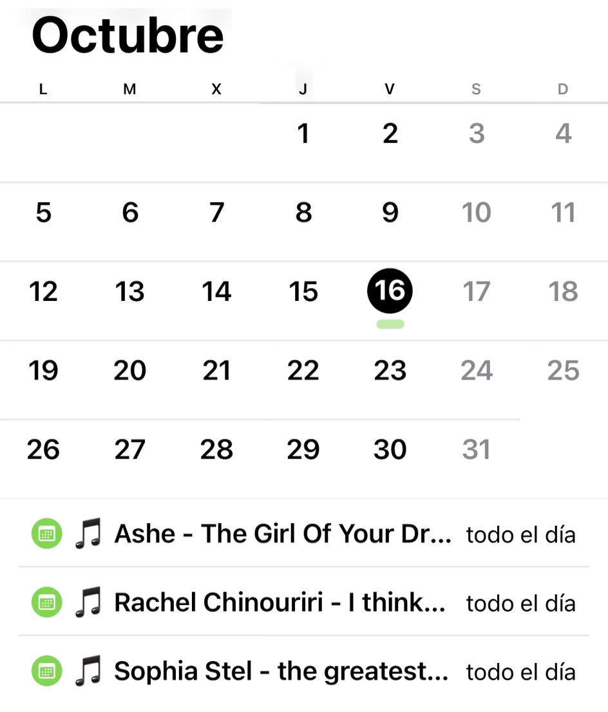

# Album Drop Calendar

Know on Tuesday which album drops on Friday.



Spotify's own release hub only tells you on release day, and most release trackers only look at the artists you *follow*. This script starts from what you actually **listen to** (your Spotify top artists), looks up announced release dates from other sources, and writes an `.ics` file you can add to any calendar app.

## How it works

```
Spotify top artists  ->  iTunes / Apple Music  ->  MusicBrainz (fallback)  ->  .ics calendar file
   (who you listen to)     (announced dates)          (community database)       (phone calendar)
```

1. Gets your top artists from Spotify (`user-top-read` scope, so it reflects real listening).
2. Checks the iTunes Search API for albums with a future release date.
3. Falls back to MusicBrainz if iTunes returns nothing.
4. Writes one all-day event per release to `upcoming_releases.ics`.

### Why not just use Spotify for release dates?

Spotify has restricted its Web API for new developer apps (for example, the endpoint for new releases was removed in 2026), so release dates have to come from another source. Spotify is used for the "who", other catalogs for the "when".

## Setup

1. Install dependencies:
   ```
   pip install -r requirements.txt
   ```
2. Create an app in the [Spotify Developer Dashboard](https://developer.spotify.com/dashboard) and add `http://127.0.0.1:8080/callback` as a Redirect URI.
3. Provide your credentials as environment variables (recommended):
   ```
   # Windows PowerShell
   $env:SPOTIFY_CLIENT_ID = "your-client-id"
   $env:SPOTIFY_CLIENT_SECRET = "your-client-secret"

   # macOS / Linux
   export SPOTIFY_CLIENT_ID="your-client-id"
   export SPOTIFY_CLIENT_SECRET="your-client-secret"
   ```
   You can also replace the placeholders at the top of the script, but never commit real keys.
4. Run it:
   ```
   python upcoming_releases.py
   ```
   The first run opens your browser to authorize the app. The token is saved in `.cache` and refreshed automatically.

## Configuration

Edit the constants at the top of `upcoming_releases.py`:

| Setting | Default | Meaning |
|---|---|---|
| `TIME_RANGE` | `short_term` | Listening window: `short_term`, `medium_term`, `long_term` |
| `TOP_N_ARTISTS` | `50` | How many top artists to check (max 50) |
| `DAYS_AHEAD` | `60` | Only report releases within this many days |
| `ICS_OUTPUT_DIR` (env var) | script folder | Where to write the `.ics` file |

## Getting it into your phone's calendar

- **One-off:** import `upcoming_releases.ics` into Google Calendar or open it on your phone.
- **Automatic:** set `ICS_OUTPUT_DIR` to a folder that has a public direct link (a cloud-synced folder or a repo's raw file URL) and subscribe to that URL from your calendar app ("From URL" in Google Calendar, "Add subscribed calendar" on iOS). Run the script on a schedule (Windows Task Scheduler, cron) and the calendar refreshes by itself.

## Limitations

- Coverage depends on the sources: iTunes is good for major-label announcements, MusicBrainz depends on community edits and can lag.
- Artist matching is by name, so artists with common names can produce false positives.
- Calendar apps decide how often subscribed calendars refresh (usually every few hours to a day).

## Privacy

Your `.cache` file (Spotify tokens) and the generated `.ics` (which reveals what you listen to) are listed in `.gitignore`. Don't commit them.

## License

MIT
